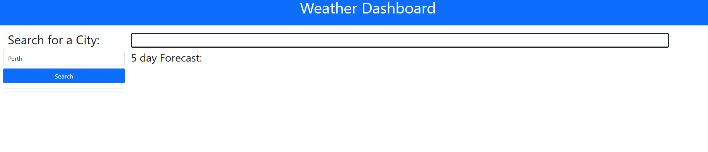

# <week-6-challenge>

## Description

Created a weather searching app, Using Openweathermap API to show the current weather and the 5 day weather forcast.

## Table of Contents (Optional)

- [Installation](#installation)
- [Usage](#usage)
- [Credits](#credits)
- [License](#license)

## Installation

run the site either on you own hosting or on the link here:
    https://ghostdads.github.io/week-6-Challenge/

## Usage

Type in the City you would like to see the weather for, then press enter or click the search button.

After you will be shown the current weather on the top right, and 5 day forcast bellow. 

## Credits
APIs: OpenweatherMaps.
Used, DayJS, Jquery and Bootstrap.
html, CSS, and JS done by me (Alexander Babic)

## License

MIT lisence

---